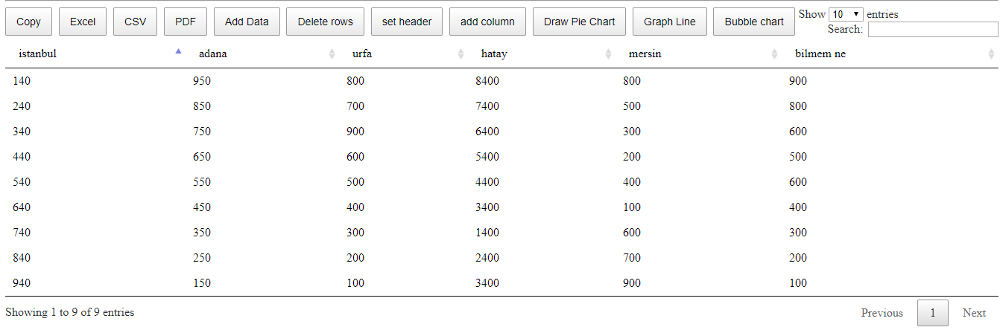
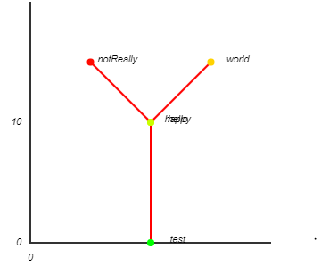
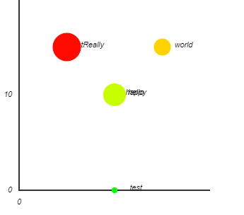
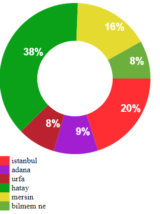
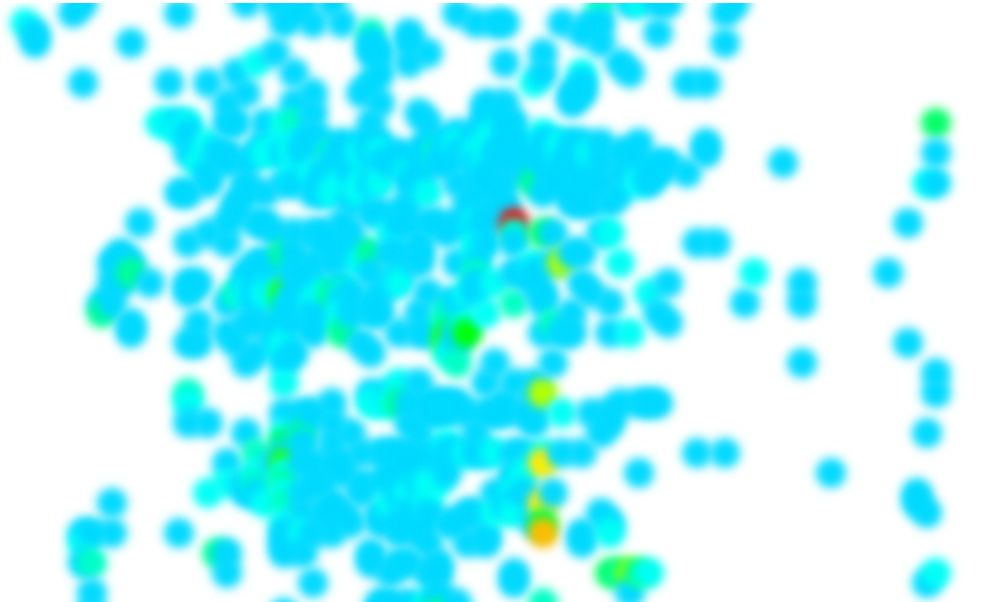

# Data visualization class
A class that aimed to read, manipulate and show data from CSV files on the screen.
I used JavaScript for this class since its much easier to visualize data using it and it can be available to anyone.

| Tasks | Short Description |
| :-------------------------------: | :---------------: |
| Read CSV file and manipulate data | |
| Line graph visualization | |
| bubble chart visualization | |
| Doughnuts visualization | |
| HeatMap visualization | |

## Read CSV file
At this task I used DataTables library to show the data on the screen and manipulated the cell by using an open source library that can do the work of the paid version of DataTables

#### Why I used data tables? 
Cause it was useful when i used it in my previous project of visa application and wanted to get more experience in it, so what is better than just using it at your class?

## Line graph 
I draw it based on an old tutorial which i will write the link of it later. 
i just changed some functions in the tutorial to draw it in the wanted way, i will write another tutorial for it later explain every bit of the code.

## bubble chart
I used a tricky solution for this one, by sending an extra array to the line graph then using this array to change the size of the circle.

## Doughnuts visualization
Even here i used a tutorial which i will refer to it later.

## HeatMap
I used a remade data on heat maps samples, filter function at canvas and HSL colors for it.

### TODO: 
- [ ] Tutorial of the whole project.
- [ ] Link of the useful articles and sources.
- [ ] clear canvs and drawing when load new file.
- [ ] change the look and feel of the website, and delete the unnecessary libraries
- [ ] change the random colour and follow colour theory for pie chart --> add extra features like choosing pie or doughnuts
- [ ] After writing the tutorial to explain the whole project i was thinking to make it kind of library to be used for anyone at any canvas size, when it needed.
- [ ] Collect the TODO list from codes XD 
- [ ] Explain further for each project